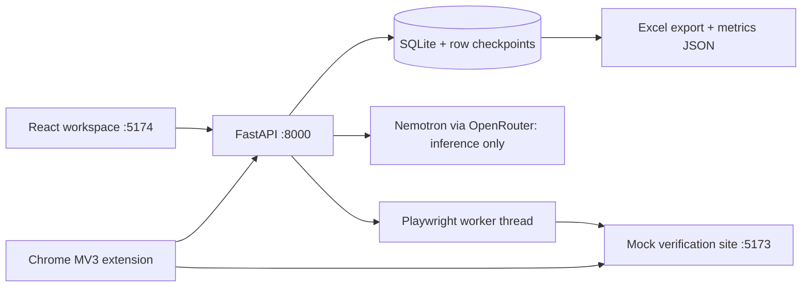

# Architecture

## Local processes

`frontend/` and `mock-site/` are independent React/TypeScript/Vite apps. The mock site is unchanged by the full MVP. FastAPI binds to loopback and handles uploads, demonstrations, workflows, and execution state. The extension contains plain JavaScript and needs no build step.

## Backend modules

- `schema.py`: strict Pydantic workflow, action, demonstration, and request schemas; fixed local URL/selector allowlist; templating constraints.
- `sheets.py`: validates CSV/XLSX input and exports results with a separate Exceptions worksheet. All exported strings are literal cells.
- `storage.py`: SQLite WAL connections and local JSON entities. `objects` stores datasets/demos/workflows/runs; `results` stores unique per-run/per-row outcomes; `inference` stores model call counts, latency, and outcome.
- `inference.py`: loads the root .env without overriding it, redacts record values, calls the fixed Nemotron model, validates its JSON, and returns safe errors. Responses and keys are not logged.
- `executor.py`: synchronous Playwright inside a dedicated worker thread for Windows compatibility. Processes the confirmed run snapshot, filters network requests, retries once, and commits each row independently.
- `main.py`: APIs, local origin/header checks, confirmation transitions, run controls, downloads, and aggregate metrics.

## Recording protocol

The frontend starts a demo for a specific dataset row and column mapping. The extension content script runs only on the mock site's root page. It polls the service worker, which polls `/teach/current`. Only while a demo is active does the recorder submit semantic events. It records focus, settled field values, submission/button metadata, navigation, and result text. Events are serialized through the service worker so their order is preserved. No coordinates or mousemove events are captured.

The backend verifies that the recorded fill matches the selected row, that a submit follows it, and that a recognized result follows the submit. Incomplete examples cannot be inferred. READ/input and WRITE/output entries in the timeline are logical spreadsheet bindings; the extension records the browser steps between them.

## Inference boundary

One Analyze request sends completed examples as redacted semantic metadata. Retrying is an explicit additional model call, counted in metrics. The model returns JSON with the four supported actions. Strict validation rejects extra fields, arbitrary code/actions/URLs/selectors, literal row values, changed columns, and invalid action ordering. No malformed response starts execution.

The provider call has a 120-second total deadline in addition to connection/read timeouts, so keepalive traffic cannot leave the UI waiting indefinitely. The frontend timeout is longer than the backend deadline, allowing the friendly Retry message to arrive first.

The explicit manual-review path uses the same recorded evidence and validation but records `source=manual`. It is never labeled as AI inference. Default end-to-end tests use real Nemotron; `--manual` is a separate outage-path test.

## Execution lifecycle and recovery

`unconfirmed workflow → confirmed workflow → running → paused/resumed → completed or stopped`.

An edit clears confirmation. A run snapshots its plan, so later edits cannot change in-flight behavior. A new run cannot begin while another run is running/paused. Completed teaching rows are seeded only on the original dataset; reused spreadsheets execute all their rows.

Each outcome is committed to SQLite under `(run_id, row_index)` before moving on. On process restart, in-progress runs become paused. Resume reads existing checkpoints and skips them. An in-flight, uncommitted lookup may repeat after a crash; the supported action is read-only, so repeating it has no external write side effects. Pause and stop take effect at the row/retry boundary; an in-flight row may finish. Downloads are reconstructed from immutable uploaded values plus committed successful outcomes at request time.

Duplicate detection is trimmed/case-insensitive across the original row order. Only the first occurrence is automatically processed; later duplicates require review. `Not Found` is a valid mock response but an uncertain business result, so it goes to review. Unresolved and unprocessed output cells retain their original values.

## Privacy, security, and operational limits

- Local, single-user development application; not an authenticated multi-user hosting service.
- Bind APIs to 127.0.0.1, not 0.0.0.0. Mutation requests need a custom application header; CORS admits the local frontend and Chrome extensions. Host checks reduce DNS rebinding exposure.
- Extension host permissions cover the local backend only; content script matches cover the local mock origin only. The script checks the port and root path again.
- Browser requests are intercepted and blocked outside the exact mock origin. No browsing of government sites, protected services, CAPTCHAs, login flows, or third-party targets.
- Working SQLite data contains spreadsheet values and local demonstration values. Do not share `backend/data/`. `.gitignore` excludes it, .env, dependencies, builds, and test output.
- The browser automation runs headlessly. Normal desktop Chrome is used for human demonstrations.
- Metrics export includes IDs, demonstration count, inference latency/calls, corrections, processed/success/failed/review/retry counts, total processing seconds, and average seconds per record. Processing time is summed row work, excludes pause time, and is not wall-clock session length.

## API families

`/health`, `/sample`, `/datasets`, `/datasets/{id}/rows/{index}`, `/demos`, `/teach/current`, `/workflows/infer`, `/workflows/manual`, `/workflows/{id}/confirm`, `/workflows/{id}/save`, `/runs`, `/runs/{id}/{pause|resume|stop}`, `/runs/{id}/exceptions`, `/runs/{id}/download`, `/dashboard`, `/metrics`, `/metrics/download`.

OpenAPI is available locally at http://127.0.0.1:8000/docs. API mutations from a client must set `X-WatchMyWork: local-demo`.
