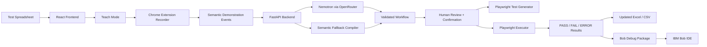

from pathlib import Path

readme = r"""# WatchMyWork

> **Show one browser test. Generate and run the rest.**

WatchMyWork is a demonstration-driven developer testing system. Instead of asking a developer to manually write repetitive browser automation from scratch, WatchMyWork records one example, converts the demonstration into a reusable workflow, generates a Playwright test, runs the workflow across a dataset, and reports **PASS / FAIL / ERROR** results.

It is designed as a local-first hackathon MVP with a human confirmation gate, deterministic browser execution, and an IBM Bob debugging handoff.

---

## Why WatchMyWork?

Developers repeatedly spend time on browser test setup, data entry, expected-vs-actual validation, and debugging failed cases.

WatchMyWork reduces that repetitive work by changing the interaction model:

**Traditional approach**

```text
Describe the test
→ write automation code
→ debug selectors
→ prepare test data
→ run cases
→ inspect failures
```

**WatchMyWork**

```text
Upload test cases
→ demonstrate one test
→ review learned workflow
→ generate Playwright test
→ run the full suite
→ inspect PASS / FAIL results
→ prepare a Bob debug package
```

The core idea is simple:

> **Do not explain every browser step to the AI. Show the workflow once.**

---

## Primary Hackathon Workflow

The main demo is a developer login-testing workflow.

A spreadsheet contains:

```text
Email | Password | Expected Result | Actual Result | Status
```

The developer demonstrates one test on the bundled local developer portal:

```text
Fill Email
→ Fill Password
→ Click Login
→ Read Result
```

WatchMyWork then:

1. records semantic browser events;
2. maps spreadsheet columns to page inputs;
3. asks Nemotron to generalize the demonstration;
4. falls back to a local semantic compiler if the model is unavailable;
5. requires human review and confirmation;
6. generates a reusable Playwright test;
7. executes all test rows deterministically;
8. compares expected and actual results;
9. reports `PASS`, `FAIL`, or `ERROR`;
10. creates a debug package that can be opened in IBM Bob IDE.

---

## What Makes It Different?

### Demonstration-first automation
The user teaches the workflow by performing it instead of writing a long automation prompt.

### AI once, deterministic execution afterward
The model is used during workflow inference, **not once per test row**. Bulk execution is handled by Playwright.

### Human confirmation gate
No learned workflow runs automatically before the user reviews and confirms it.

### Developer-focused outputs
WatchMyWork produces:

- generated Playwright test code;
- PASS / FAIL / ERROR test results;
- updated spreadsheet output;
- failed-case summaries;
- reusable workflow JSON;
- IBM Bob debug packages.

### Local-first privacy
Spreadsheet contents, browser execution, checkpoints, and most test artifacts stay on the local machine. Only the minimum semantic workflow information required for inference is sent to the configured model provider.

---

## Architecture



### Components

| Component | Purpose |
|---|---|
| React + TypeScript frontend | Upload test data, configure mappings, review workflow, run tests, inspect results |
| FastAPI backend | Workflow validation, inference orchestration, persistence, test generation, execution |
| Chrome Extension (Manifest V3) | Records semantic browser actions during Teach Mode |
| Playwright | Deterministic browser test execution |
| SQLite | Local run state, checkpoints, workflow persistence |
| Nemotron via OpenRouter | Generalizes a recorded demonstration into a reusable workflow |
| Semantic fallback compiler | Keeps the demo usable if the free model is slow or unavailable |
| IBM Bob IDE | Reviews/debugs failed cases using the generated debug package |

---

## IBM Bob Integration

IBM Bob is part of the developer debugging workflow.

When WatchMyWork identifies failed test cases, it can create a **Bob Debug Package** containing artifacts such as:

```text
generated_test.spec.py
failed_tests.json
workflow.json
failure_summary.md
runtime / error information
```

A developer opens this package in IBM Bob IDE to inspect the failure, reason about whether the issue comes from the application, selector, generated test, or test data, and propose a targeted fix.

The repository also contains:

```text
bob_sessions/
```

This folder stores authentic Bob task/session summary screenshots used as hackathon evidence.

> WatchMyWork does not fake a Bob API integration. Bob is used directly through IBM Bob IDE.

---

## Secondary Real-Time Weather Demo

The bundled mock site also contains a secondary Open-Meteo demo.

At:

```text
http://127.0.0.1:5173/
```

the user can enter latitude and longitude and retrieve the current temperature from Open-Meteo.

This demonstrates that the same browser-facing infrastructure can interact with live external data, while the **developer testing workflow remains the primary hackathon use case**.

---

## Local URLs

| Component | Default URL |
|---|---|
| WatchMyWork frontend | `http://127.0.0.1:5174/` |
| Developer test portal | `http://127.0.0.1:5173/developer` |
| Weather demo | `http://127.0.0.1:5173/` |
| Backend | `http://127.0.0.1:8000/` |
| API docs | `http://127.0.0.1:8000/docs` |

Use `127.0.0.1` rather than `localhost` because the recorder and local browser automation intentionally use the exact local origin.

---

## Tech Stack

### Frontend
- React
- TypeScript
- Vite

### Backend
- Python
- FastAPI
- Pydantic
- SQLite
- openpyxl / spreadsheet processing

### Automation
- Chrome Extension Manifest V3
- Playwright

### AI
- OpenRouter
- `nvidia/nemotron-3.5-lightning:free`
- local semantic workflow fallback

### Developer workflow
- IBM Bob IDE
- generated Playwright tests
- structured debug packages

---

## Repository Structure

```text
WatchMyWork/
├── backend/              # FastAPI API, schemas, inference, executor, persistence
├── frontend/             # React + TypeScript application
├── extension/            # Chrome semantic recorder
├── mock-site/            # Developer portal + real-time weather demo
├── sample-data/          # Safe synthetic test datasets
├── scripts/              # E2E and validation utilities
├── bob_sessions/         # IBM Bob task/session evidence screenshots
├── bob_debug_package/    # Local generated debug artifacts (ignored by Git)
├── ARCHITECTURE.md       # Detailed system architecture
├── PROJECT_SPEC.md       # Supported behavior and acceptance criteria
├── AGENTS.md             # Contributor / validation instructions
├── .env.example          # Environment-variable template
└── README.md
```

---

## Local Setup

### Requirements

- Python 3.13
- Node.js 24+
- npm
- Google Chrome
- Git

Create the Python environment and install dependencies:

```powershell
python -m venv .venv
.\.venv\Scripts\python.exe -m pip install -r backend/requirements-lock.txt
.\.venv\Scripts\python.exe -m playwright install chromium
npm.cmd --prefix frontend ci
npm.cmd --prefix mock-site ci
```

Create a root `.env` file containing:

```text
OPENROUTER_API_KEY=your_key_here
```

Never commit `.env` or expose the API key in frontend code.

---

## Run Locally

Open three PowerShell terminals from the repository root.

### 1. Backend

```powershell
.\.venv\Scripts\python.exe -m uvicorn backend.main:app --host 127.0.0.1 --port 8000
```

### 2. Main frontend

```powershell
npm.cmd --prefix frontend run dev -- --host 127.0.0.1 --port 5174
```

### 3. Developer portal / weather demo

```powershell
npm.cmd --prefix mock-site run dev -- --host 127.0.0.1 --port 5173
```

Stop a server with:

```text
Ctrl + C
```

---

## Load the Chrome Extension

1. Open `chrome://extensions`.
2. Enable **Developer Mode**.
3. Select **Load unpacked**.
4. Choose the repository's `extension/` folder.
5. Refresh the developer portal after reloading the extension.

The extension records only the bundled local demo origin and only while Teach Mode is active.

---

## Developer Demo

Use the included developer test dataset.

### Example test cases

| Email | Password | Expected Result |
|---|---|---|
| `dev@example.com` | `test123` | `Login successful` |
| `admin@example.com` | `admin123` | `Login successful` |
| `dev@example.com` | `wrongpass` | `Invalid credentials` |
| `unknown@example.com` | `abc123` | `User not found` |
| blank | blank | `Email and password are required` |

### Demo flow

1. Upload the developer test spreadsheet.
2. Select `Email` and `Password` as inputs.
3. Select `Expected Result`, `Actual Result`, and `Status`.
4. Start Teach Mode.
5. Open `http://127.0.0.1:5173/developer`.
6. Demonstrate one login test.
7. Wait for **Test demonstration captured**.
8. Analyze the workflow.
9. Review and confirm it.
10. Generate the Playwright test.
11. Run the full test suite.
12. Inspect PASS / FAIL / ERROR results.
13. Prepare the Bob Debug Package for any failed test.

---

## Generated Playwright Test

WatchMyWork can generate a reusable, data-driven Playwright test from the learned workflow.

The generated test is based on semantic mappings such as:

```text
Email    → #email-input
Password → #password-input
Click    → #login-button
Result   → #login-result
```

The test is not limited to the single row demonstrated during Teach Mode.

---

## Reliability and Safety

The hackathon MVP includes several safeguards:

- strict workflow schema validation;
- selector and origin validation;
- human confirmation before execution;
- no model call per spreadsheet row;
- automatic model retry handling;
- semantic fallback if Nemotron is unavailable;
- local SQLite checkpoints;
- run recovery after interruption;
- per-row execution isolation;
- PASS / FAIL / ERROR reporting;
- retry on browser automation errors;
- API keys excluded from Git;
- local debug packages excluded from Git.

---

## Validation

Run from the repository root:

```powershell
.\.venv\Scripts\python.exe -m pytest backend/tests -q --basetemp=.pytest_tmp
npm.cmd --prefix frontend run build
npm.cmd --prefix mock-site test
npm.cmd --prefix mock-site run build
node extension/validate.mjs
```

Current hackathon review baseline:

```text
Backend tests:      65 passing
Mock-site tests:    23 passing
Frontend build:     passing
Mock-site build:    passing
Extension validate: passing
```

For full browser validation:

```powershell
.\.venv\Scripts\python.exe -X utf8 scripts/developer_e2e.py
```

---

## Privacy

WatchMyWork is intentionally local-first.

The system is designed so that:

- spreadsheets are processed locally;
- browser automation runs locally;
- run state is stored locally in SQLite;
- generated debug packages remain local;
- `.env` and local databases are excluded from Git;
- only the minimum semantic workflow information needed for inference is sent to OpenRouter;
- the system does not make a model request for every test row.

Do not use real credentials, client-confidential data, personal information, or restricted datasets in the hackathon demo.

---

## Current MVP Scope

WatchMyWork currently focuses on:

- spreadsheet-driven browser testing;
- semantic demonstration recording;
- structured workflow inference;
- deterministic Playwright execution;
- expected-vs-actual assertions;
- reusable test generation;
- developer debugging handoff.

It is a hackathon MVP, not a general-purpose autonomous browser agent.

---

## Roadmap

Potential next steps include:

- arbitrary multi-page developer workflows;
- richer assertion types;
- automatic selector repair;
- repository-aware test generation;
- CI integration;
- richer Bob-assisted debugging workflows;
- more reusable workflow templates;
- secure team collaboration;
- optional cloud deployment while preserving local/private execution modes.

---

## Hackathon Story

**Problem:** browser testing is repetitive and expensive to author manually.

**Insight:** a developer often knows how to perform the test already — the missing piece is turning that demonstration into reusable automation.

**Solution:** WatchMyWork observes one browser test, converts it into a validated workflow, generates Playwright automation, executes the full dataset, reports failures, and packages debugging context for IBM Bob.

**Result:** fewer repetitive manual steps, faster test creation, reusable automation, and a direct path from failure detection to developer debugging.

---

## License

Add the license selected for the hackathon submission here.
"""

path = Path("/mnt/data/README_WatchMyWork_Final.md")
path.write_text(readme, encoding="utf-8")
print(path)
