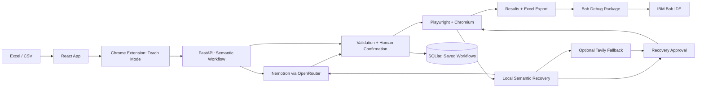

# WatchMyWork — Show Once. Automate Anywhere.

Demonstrate a browser workflow once, turn it into reusable automation, and run it across spreadsheet records with Playwright. **Adaptive Recovery / Search Agent** is the newest feature: when a page changes, WatchMyWork searches for an equivalent action, explains its proposal, and asks for approval before continuing.

**Team: Titans Arc**

**Team Leader: M Farhat Mehdi**

[Live app](https://watchmywork-production.up.railway.app) · [Repository](https://github.com/Malang43/WatchMyWork)

Built for the **IBM Bob 2.0 Hackathon**, demonstrating Generative AI, Agentic AI, AI Workflows, Business Process Automation, and IBM Bob integration. The current MVP automates only bundled demo pages; the tagline describes the broader vision.

## What Problem It Solves

Repeated browser work often follows the same pattern: copy a value from an Excel row, paste it into a website, click/search, read the result, and update the output. Writing and maintaining automation adds effort, especially when selectors change.

WatchMyWork learns from a demonstration. Its primary demo tests a synthetic developer login form using `Email`, `Password`, `Expected Result`, `Actual Result`, and `Status` columns. It compares expected and actual results and reports **PASS / FAIL / ERROR**.

## How It Works

```text
Upload Data → Map Columns → Demonstrate Once → AI Understands Workflow
→ Human Confirms → Playwright Executes → PASS / FAIL / ERROR Results
```

The custom Chrome extension records semantic actions during Teach Mode. NVIDIA Nemotron through OpenRouter generalizes the demonstration into a structured workflow. The backend validates schemas, selectors, mappings, and origins before human confirmation. A local semantic compiler supports the developer demo when inference is unavailable; the weather manual path is explicitly labeled as an inference-outage fallback.

Playwright executes confirmed plans across records, checkpoints each result, and exports updated Excel output. Ordinary rows do not make model calls. Developer workflows also support generated, data-driven Playwright tests and a Bob debugging handoff.

### Saved Workflows

Confirmation automatically saves workflows in SQLite. **Saved Workflows** remains available after refresh and backend restart when the database is retained. Users can **Load Workflow**, **Run Saved Workflow**, or **Use on another spreadsheet**. Editing a plan requires confirmation again. Successfully verified, approved recovery mappings are stored for reuse.

## Adaptive Recovery Agent

When a recorded step fails, the agent follows a bounded recovery loop:

```text
Detect Failure → Inspect Page → Search Candidates → AI Reasoning
→ Recovery Proposal → Approve & Continue → Execute → Verify → Remember
```

It inspects visible elements and compares accessible text/name, role, label, placeholder, input type, and form context. Nemotron through OpenRouter can choose an equivalent action from discovered compatible candidates using validated JSON. A deterministic semantic fallback keeps local recovery available during model outages.

The run screen shows the original action, replacement, reason, method, and confidence. Confidence is a ranking estimate. Each new repair needs **Approve & Continue**; users may also **Reject** or **Stop Run**. Playwright rechecks the candidate after approval and resumes execution. Stale or ambiguous matches fail safely. Verified repairs are remembered in SQLite and reused only when a unique equivalent element remains.

**Implemented recovery example:**

| Recorded page | Changed page |
|---|---|
| Login — `#login-button` | Sign In — `#sign-in-button` |
| `/developer` | `/developer?recovery_demo=1` |

The changed page keeps the same synthetic login behavior. Results retain **PASS / FAIL / ERROR**, with a recovered annotation. Recovery history appears in the run, test report, Excel **Recoveries** worksheet, and Bob Debug Package. Standalone generated tests contain the original confirmed plan; interactive recovery and memory belong to the WatchMyWork executor.

## Search Agent / Tavily Fallback

**Local semantic page search is the primary recovery mechanism.** External search is optional:

```text
Local Page Search → AI Semantic Reasoning → Tavily Search Fallback
```

If local recovery is insufficient and a page/function may have moved, the backend can use Tavily with `TAVILY_API_KEY`. The application works without Tavily; missing credentials or service failures preserve local recovery and normal failure reporting.

Tavily is skipped for loopback sites. Hosted search uses a domain filter, and navigation targets must match the configured origin and explicitly allowed bundled pages, including `/developer/sign-in`. Navigation requires approval and fresh local discovery. Arbitrary same-domain routes and third-party targets are blocked. Public indexing of the Railway demo is not guaranteed.

## Architecture


```mermaid
flowchart LR
    A[Excel / CSV] --> B[React App]
    B --> C[Chrome Extension: Teach Mode]
    C --> D[FastAPI: Semantic Workflow]
    D --> E[Nemotron via OpenRouter]
    E --> F[Validation + Human Confirmation]
    D --> F
    F --> G[Playwright + Chromium]
    F --> H[(SQLite: Saved Workflows)]
    G --> I[Results + Excel Export]
    G --> J[Local Semantic Recovery]
    J --> E
    J --> K[Optional Tavily Fallback]
    J --> L[Recovery Approval]
    K --> L
    L --> G
    I --> M[Bob Debug Package]
    M --> N[IBM Bob IDE]
```

| Directory | Purpose |
|---|---|
| `frontend/` | Uploads, mappings, Teach Mode, confirmation, saved workflows, results, recovery approval |
| `backend/` | FastAPI, inference, validation, SQLite persistence, execution, recovery, exports |
| `extension/` | Custom Manifest V3 Chrome semantic recorder; no build step |
| `mock-site/` | Independently working developer portal and Open-Meteo weather demo |
| `sample-data/` | Synthetic CSV/XLSX inputs, including `developer-tests.csv` |
| `scripts/` | Sample generation and browser validation |
| `bob_sessions/` | IBM Bob task/session evidence location |

See [ARCHITECTURE.md](ARCHITECTURE.md), [PROJECT_SPEC.md](PROJECT_SPEC.md), and [RECOVERY_VALIDATION.md](RECOVERY_VALIDATION.md) for implementation details and prior validation evidence.

## Technology Stack

| Area | Technologies |
|---|---|
| Interface | React, TypeScript, Vite |
| Backend and storage | Python, FastAPI, Pydantic, SQLite, openpyxl |
| Browser automation | Custom Chrome Extension, Playwright, Chromium |
| AI and search | NVIDIA Nemotron (`nvidia/nemotron-3.5-lightning:free`), OpenRouter, optional Tavily |
| Delivery and debugging | Railway, Docker, GitHub, IBM Bob IDE integration |

## IBM Bob Integration

IBM Bob was used as part of the **IBM Bob 2.0 Hackathon** development and debugging workflow. WatchMyWork generates a structured **Bob Debug Package** with context from failed or problematic developer test runs:

```text
generated_test.spec.py   test_cases.json   failed_tests.json
workflow.json           runtime_logs.json
selectors.json          failure_summary.md
```

After a developer run, choose **Prepare Bob Debug Package**, download the ZIP, extract it, and open the folder in **IBM Bob IDE**. The package supports investigation of application behavior, selectors, generated tests, and test data; runtime logs include recovery audit history.

The repository retains [`bob_sessions/`](bob_sessions/) for authentic IBM Bob task/session summary screenshots used as hackathon evidence. Generated packages default to the Git-ignored `bob_debug_package/` directory. Packages contain test data and should be reviewed before sharing.

This is a direct IBM Bob IDE debugging handoff. No IBM Bob API is called, and Bob is not used for every execution step.

## Chrome Extension Installation

1. Open the [GitHub repository](https://github.com/Malang43/WatchMyWork), choose **Code → Download ZIP**.
2. Extract the project.
3. Open `chrome://extensions` in Chrome.
4. Enable **Developer Mode**.
5. Click **Load unpacked**.
6. Select the project's `extension` folder containing `manifest.json`.
7. Refresh the demo tab after installing or reloading the extension.

The checked-in extension supports the bundled local demo and linked Railway origin. Recording is restricted to approved demo paths while Teach Mode is active. Enable one WatchMyWork recorder at a time.

## Quick Demo

### Normal test

1. Install the extension and open the live app or local WatchMyWork frontend.
2. Upload an Excel test sheet with the five developer columns, or use `sample-data/developer-tests.csv`.
3. Map **Email** and **Password** as inputs; map **Expected Result**, **Actual Result**, and **Status**.
4. Start Teach Mode recording and open `/developer` on the demo origin.
5. Enter `dev@example.com` and `test123`, then click **Login**.
6. Wait for **Login successful** and **Test demonstration captured**. Developer recording saves automatically; use **Stop Recording** if recording remains active.
7. Analyze, review, and confirm the workflow.
8. Run the test suite and view **PASS / FAIL / ERROR**. Download updated Excel or prepare a Bob Debug Package as needed.
9. Choose **Save Workflow** after the run if needed; confirmation already saves it automatically.

### Recovery Agent test

1. Open **Saved Workflows** and load the confirmed developer workflow. Do not record again.
2. Optionally inspect `/developer?recovery_demo=1`: it shows **Sign In** with `#sign-in-button` instead of **Login** with `#login-button`.
3. Click **Run Recovery Demo** in Saved Workflows. This sends the executor's separate browser to the changed URL while preserving the recorded plan.
4. Review **Login → Sign In**, its reason, and confidence.
5. Click **Approve & Continue**. Playwright resumes and verifies the result.
6. Inspect the recovered annotation and recovery history. Matching expected results remain **PASS**.

**Run Saved Workflow** uses the normal URL; opening a changed page in another tab alone does not change its target. Existing verified repairs are reused without a new approval prompt. For first-approval validation, use an isolated fresh test database; preserve working datasets and results.

The secondary weather demo uses Open-Meteo at local `/` or hosted `/weather`. It demonstrates live data through a bundled page; developer testing remains the primary hackathon workflow.

## Environment Variables

Configure the backend privately through the root `.env` or server environment. Use [.env.example](.env.example) as the template. Never commit secrets or place them in `VITE_` variables.

```dotenv
OPENROUTER_API_KEY=
TAVILY_API_KEY=
```

| Variable | Purpose |
|---|---|
| `OPENROUTER_API_KEY` | Enables Nemotron workflow inference and recovery reasoning |
| `TAVILY_API_KEY` | Optional external search fallback; unnecessary for local recovery |
| `DATABASE_PATH` | SQLite path; defaults to `backend/data/watchmywork.sqlite3`; use `/data/watchmywork.sqlite3` on Railway |
| `WATCHMYWORK_DATA_DIR` | Optional default database directory when `DATABASE_PATH` is absent |
| `BOB_DEBUG_DIR` | Package directory; defaults to `bob_debug_package/`; use `/data/bob_debug_package` on Railway |
| `WATCHMYWORK_PRODUCTION` | Set to `1` for hosted mode; set by the Docker image |
| `PUBLIC_ORIGIN` | Optional exact HTTPS origin override, without a path or port |
| `RAILWAY_PUBLIC_DOMAIN` | Railway-provided domain used when no explicit public origin is set |
| `PORT` | Server port supplied by Railway; defaults to 8000 |

## Local Setup

Use Python 3.13, Node.js 24+, npm, Git, and Google Chrome. From the repository root in PowerShell:

```powershell
python -m venv .venv
.\.venv\Scripts\python.exe -m pip install -r backend/requirements-lock.txt
.\.venv\Scripts\python.exe -m playwright install chromium
npm.cmd --prefix frontend ci
npm.cmd --prefix mock-site ci
```

Create the root `.env` privately from the template. Start each server in a separate terminal:

```powershell
.\.venv\Scripts\python.exe -m uvicorn backend.main:app --host 127.0.0.1 --port 8000
```

```powershell
npm.cmd --prefix frontend run dev -- --host 127.0.0.1 --port 5174
```

```powershell
npm.cmd --prefix mock-site run dev -- --host 127.0.0.1 --port 5173
```

| Component | Local URL |
|---|---|
| Main app | `http://127.0.0.1:5174/` |
| Developer portal | `http://127.0.0.1:5173/developer` |
| Recovery demo | `http://127.0.0.1:5173/developer?recovery_demo=1` |
| Weather demo | `http://127.0.0.1:5173/` |
| Backend / API docs | `http://127.0.0.1:8000/` / `http://127.0.0.1:8000/docs` |

Use the exact `127.0.0.1` origins for local recording and automation.

### Railway deployment

The root `Dockerfile` builds both Vite apps and installs Python dependencies and Chromium. `railway.json` configures `/health`; `python -m backend` starts the service. Hosted routes are `/` for the main app, `/developer` for the portal, and `/weather` for the weather demo.

Mount a persistent volume at `/data`, set `OPENROUTER_API_KEY`, retain `DATABASE_PATH=/data/watchmywork.sqlite3` and `BOB_DEBUG_DIR=/data/bob_debug_package`, and optionally set `TAVILY_API_KEY`. Use one replica and one worker. Workflows, results, checkpoints, and recovery memory survive container replacement only when the database volume is retained.

Railway supplies `PORT` and `RAILWAY_PUBLIC_DOMAIN`; restart/redeploy after assigning the public domain. For another domain, set `PUBLIC_ORIGIN` and generate a matching extension:

```powershell
node extension/configure.mjs https://YOUR_FINAL_RAILWAY_DOMAIN
node extension/validate.mjs ../extension-production
```

Load the generated folder in Chrome and record new workflows for the new origin. The existing local extension and three-server setup remain available.

## Safety / Reliability

- Strict Pydantic schemas, selector checks, and exact origin validation; automation is limited to bundled demo pages.
- Explicit workflow confirmation and approval for new recovery proposals; models cannot invent recovery selectors or executable JavaScript.
- Playwright executes plans; ordinary rows and approved memory reuse do not make per-row model calls.
- Per-row isolation, bounded retries/recovery, and SQLite checkpoints committed before advancing preserve progress across interruptions.
- Spreadsheet values are stripped from inference requests and metrics; discovery avoids input values, cookies, and browser storage. Secrets and full model responses are not logged.
- In local mode, data, execution, results, and debug artifacts stay on the machine. Hosted mode stores and executes them on Railway.
- The hosted MVP is a shared workspace without user authentication. Use synthetic data; access control is a prerequisite for sensitive or multi-user use.

### Validation

Run repository checks from PowerShell:

```powershell
.\.venv\Scripts\python.exe -m pytest backend/tests -q
npm.cmd --prefix frontend run build
npm.cmd --prefix mock-site test
npm.cmd --prefix mock-site run build
node extension/validate.mjs
```

For browser validation, start all three servers against an isolated test database and run sequentially without editing the frontend:

```powershell
.\.venv\Scripts\python.exe -X utf8 scripts/developer_e2e.py
.\.venv\Scripts\python.exe -X utf8 scripts/recovery_e2e.py
.\.venv\Scripts\python.exe -X utf8 scripts/weather_e2e.py --manual
```

The recovery script expects the preceding developer workflow and fresh recovery memory. `--manual` validates the labeled inference-outage path, not live Nemotron availability. Backend tests use temporary databases and mocked model responses. See [RECOVERY_VALIDATION.md](RECOVERY_VALIDATION.md) for prior results and limitations; those checks were not rerun for this documentation update.

## Project Status

Hackathon MVP with semantic recording, workflow inference, human confirmation, saved workflows, Playwright execution, Excel export, generated developer tests, IBM Bob debug packages, and adaptive recovery with approval and memory.

Existing validation records real browser Login → Sign In recovery using deterministic fallback, plus mocked tests for AI recovery selection. Live Tavily was not exercised in that report. Model availability, external weather connectivity, and search indexing remain dependencies. The linked Railway app is the deployment entry point; deployment health is not asserted by this README.

## Roadmap

- Broader, explicitly validated multi-page workflows and recovery intents.
- Richer assertions and reusable workflow templates.
- Repository-aware test generation and CI integration.
- Expanded IBM Bob-assisted debugging workflows.
- Secure team collaboration and access control while retaining local execution options.
